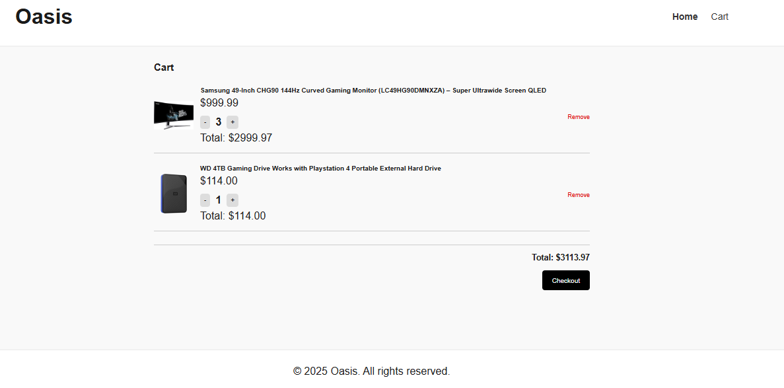

# Oasis - Shopping App

Oasis is a simple React-based web application that allows users to browse products, view detailed information, add items to a cart, and manage their orders. It uses the [Fake Store API](https://fakestoreapi.com/) for sample product data.

## 🚀 Features

- 🔍 Browse and view product details
- 🛒 Add/remove items from the cart
- ➕ Increment or decrement quantity
- 💰 View total price per item and overall
- 🔄 Handles invalid product pages
- 🧭 Friendly 404 page for wrong routes
- 📱 Responsive and clean UI

## 📸 Preview




## 📂 Project Structure

```
src/
├── components/       # Reusable UI components
├── pages/            # Page components (Home, Product, Cart, etc.)
├── css/              # Stylesheets (index.css)
├── App.js            # Main App component
├── index.js          # Entry point
└── assets/           # Images/screenshots (optional)
```

## 🛠️ Technologies Used

- **React** (with hooks)
- **React Router DOM** (routing)
- **Axios** (API requests)
- **CSS** (custom styling)
- **Fake Store API** (sample product data)

## 📦 Installation

1. **Clone the repo**
   ```bash
   git clone https://github.com/yourusername/oasis-app.git
   cd oasis-app
   ```

2. **Install dependencies**
   ```bash
   npm install
   ```

3. **Run the development server**
   ```bash
   npm start
   ```

## 🧭 Routing

- `/` – Home page with product listings
- `/product/:id` – Product detail page
- `/cart` – Shopping cart page
- Any unknown route – Redirects to **NotFound** page
- Invalid product ID – Redirects to **Home**

## 🙌 Credits

- [Fake Store API](https://fakestoreapi.com/)
- Built by Ayomide Boye-Ogundiya (MITT Project)

## 📃 License

This project is for educational purposes.
